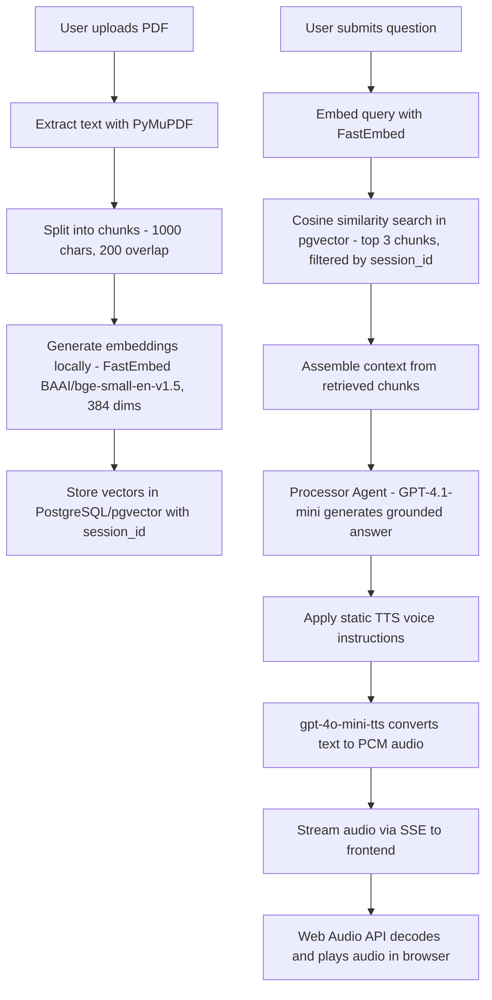

# Voice RAG

A voice-enabled Retrieval-Augmented Generation system. Upload PDF documents, ask questions in natural language, and receive spoken answers streamed in real time through the browser.

## Architecture

Three Docker containers orchestrated with Docker Compose: PostgreSQL with pgvector for vector storage, a FastAPI backend handling embeddings, retrieval, agent processing, and TTS, and a Next.js frontend managing uploads, queries, and audio playback. Multi-tenancy is session-based -- each user gets a unique session ID stored in localStorage, and all database queries are scoped to that session. Embeddings run locally on the backend via FastEmbed, so no external embedding API calls are needed.

```
voice_rag/
├── backend/
│   ├── main.py               # App entry, lifespan events
│   ├── config.py              # Env vars, rate limit settings
│   ├── routers/
│   │   ├── session.py         # Session creation and status
│   │   ├── documents.py       # PDF upload and management
│   │   └── query.py           # Question submission, audio streaming
│   ├── services/
│   │   ├── session_service.py    # In-memory session store with TTL
│   │   ├── vector_service.py     # pgvector insert and search
│   │   ├── embedding_service.py  # FastEmbed wrapper
│   │   ├── agent_service.py      # Processor Agent (GPT-4.1-mini)
│   │   └── audio_service.py      # TTS generation (gpt-4o-mini-tts)
│   ├── models/schemas.py      # Pydantic request/response models
│   └── utils/pdf_processor.py # PyMuPDF text extraction + chunking
└── frontend/
    └── src/
        ├── app/               # Next.js pages
        ├── components/        # shadcn/ui components
        ├── hooks/             # useSession, useDocuments, useQuery, useAudioStream
        ├── lib/               # API client, audio utilities
        └── types/             # TypeScript type definitions
```

## Pipeline



### Stage Breakdown

1. **Text Extraction** -- PyMuPDF parses the uploaded PDF and extracts raw text from all pages.
2. **Chunking** -- The text is split into overlapping segments of 1000 characters with 200-character overlap using langchain-text-splitters, preserving context across chunk boundaries.
3. **Local Embedding** -- Each chunk is embedded using FastEmbed with the BAAI/bge-small-en-v1.5 model, producing 384-dimensional vectors. This runs entirely on the backend CPU with no external API calls.
4. **Vector Storage** -- Embeddings are inserted into PostgreSQL via the pgvector extension, tagged with the user's session_id for isolation.
5. **Query Embedding** -- The user's question is embedded with the same model to ensure vector space alignment.
6. **Vector Search** -- pgvector performs cosine similarity search, returning the top 3 most relevant chunks scoped to the user's session.
7. **Context Assembly** -- Retrieved chunks are concatenated into a context block passed to the LLM.
8. **Agent Processing** -- A Processor Agent powered by GPT-4.1-mini receives the context and question, generating a grounded answer that stays faithful to the source material.
9. **TTS Streaming** -- The answer text is sent to gpt-4o-mini-tts with static voice instructions. The resulting PCM audio is streamed to the frontend as Server-Sent Events.
10. **Audio Playback** -- The frontend's Web Audio API decodes the PCM stream in real time, supporting pause and resume controls.

## Tech Stack

| Component | Technology | Role |
|-----------|------------|------|
| Frontend | Next.js 15, React 19, Tailwind CSS, shadcn/ui | UI, audio playback, session management |
| Backend | FastAPI, Python 3.12, OpenAI Agents SDK | REST API, orchestration, business logic |
| Database | PostgreSQL 17 with pgvector extension | Vector storage and cosine similarity search |
| Embeddings | FastEmbed (BAAI/bge-small-en-v1.5, 384 dims) | Local embedding generation, no external API |
| PDF Parsing | PyMuPDF + langchain-text-splitters | Text extraction and chunking |
| LLM | GPT-4.1-mini via OpenAI API | RAG answer generation |
| TTS | gpt-4o-mini-tts via OpenAI API | Text-to-speech audio streaming |
| Reverse Proxy | Traefik v3 | HTTPS termination, routing, security headers |
| Containerization | Docker Compose | Multi-service orchestration |

## Getting Started

### Prerequisites

- Docker and Docker Compose
- An OpenAI API key with access to gpt-4.1-mini and gpt-4o-mini-tts
- A Traefik reverse proxy on the `proxy` Docker network (for production deployment)

### Environment Variables

Create a `.env` file in the project root:

```
OPENAI_API_KEY=sk-...
POSTGRES_USER=postgres
POSTGRES_PASSWORD=your_secure_password
POSTGRES_DB=voicerag
```

Backend-level configuration (set in `docker-compose.yml` or backend `.env`):

| Variable | Default | Description |
|----------|---------|-------------|
| `DATABASE_URL` | Built from PG vars | PostgreSQL connection string |
| `CORS_ORIGINS` | `["https://voicerag.pgdev.com.br"]` | Allowed frontend origins (JSON array) |
| `SESSION_INACTIVITY_MINUTES` | `5` | Minutes before a session expires |
| `MAX_QUERIES_PER_SESSION` | `5` | Maximum questions per session |
| `MAX_DOCUMENTS_PER_SESSION` | `3` | Maximum PDF uploads per session |
| `MAX_SESSIONS_PER_MINUTE` | `10` | Global session creation rate limit |
| `PROCESSOR_MODEL` | `gpt-4.1-mini` | LLM model for RAG processing |
| `TTS_MODEL` | `gpt-4o-mini-tts` | Model for speech synthesis |

Frontend environment (passed as build arg):

| Variable | Default | Description |
|----------|---------|-------------|
| `NEXT_PUBLIC_API_URL` | `https://voicerag-api.pgdev.com.br` | Backend API base URL |

### Running with Docker

```bash
cd /opt/showcase/voice_rag
docker compose up -d
```

The system starts three containers:

- `voicerag-db` -- PostgreSQL 17 with pgvector, creates the vector extension on first boot
- `voicerag-backend` -- FastAPI on port 8000, waits for a healthy database before starting
- `voicerag-frontend` -- Next.js on port 3000, waits for a healthy backend before starting

Verify the deployment:

```bash
docker compose ps
docker compose logs -f backend
```

### Local Development (without Docker)

Backend:

```bash
cd backend
python -m venv venv
source venv/bin/activate
pip install -r requirements.txt
cp .env.example .env   # edit with your OPENAI_API_KEY and DATABASE_URL
uvicorn main:app --reload --port 8000
```

Frontend:

```bash
cd frontend
npm install
echo "NEXT_PUBLIC_API_URL=http://localhost:8000" > .env.local
npm run dev
```

Requires a running PostgreSQL instance with the pgvector extension enabled.

## API Reference

| Endpoint | Method | Description |
|----------|--------|-------------|
| `/api/session` | POST | Create a new session. Returns session ID and quota info. |
| `/api/session/{id}` | GET | Get session status, remaining quotas, and uploaded documents. |
| `/api/session/{id}/documents` | POST | Upload a PDF file. Extracts, chunks, embeds, and stores vectors. |
| `/api/session/{id}/query` | POST | Submit a question. Returns the text answer and a query ID for audio. |
| `/api/session/{id}/query/{qid}/audio/stream` | GET | SSE endpoint streaming PCM audio for a given query response. |
| `/health` | GET | Backend health check. |

## Rate Limits

This system is designed as a portfolio showcase with intentional rate limits to control API costs:

| Limit | Value | Scope |
|-------|-------|-------|
| Queries per session | 5 | Per session |
| Documents per session | 3 | Per session |
| Session creation | 10/minute | Global sliding window |
| Session inactivity timeout | 5 minutes | Per session |

Sessions are stored in memory with a background cleanup task that removes inactive sessions and their associated vectors from the database every minute.
